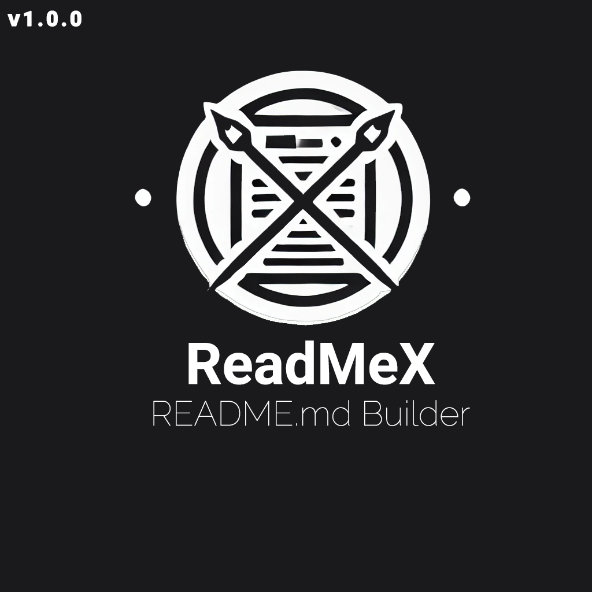
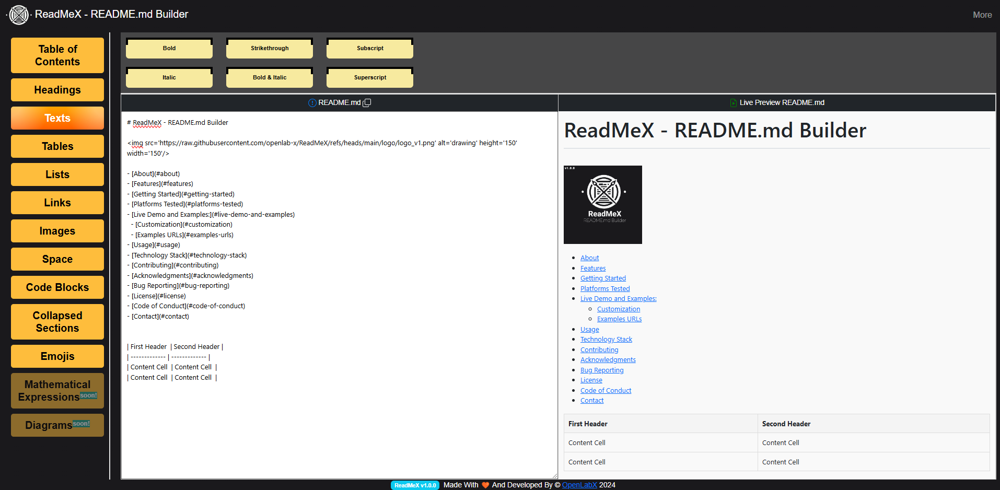

# ReadMeX - README.md Builder  [](https://github.com/openlab-x/GitHubViewsCounter)




  - [Made With GitHubViewsCounter](https://github.com/openlab-x/GitHubViewsCounter)

## About

**ReadMeX** is a web-based markdown editor designed to help you create well-structured and professional-looking `README.md` files for your projects. It supports features like live preview, drag-and-drop markdown elements, and code syntax highlighting, making the process of creating a `README.md` easier and more efficient.

- [About](#about)
- [Features](#features)
- [Live Demo](#live-demo)
- [Screenshots](#screenshots)
- [Getting Started](#getting-started)
  - [Prerequisites](#prerequisites)
  - [Installing Dependencies](#installing-dependencies)
  - [Running Locally](#running-locally)
  - [Running on a Public Host](#running-on-a-public-host)
- [Platforms Tested](#platforms-tested)
- [Usage](#usage)
- [Technology Stack](#technology-stack)
- [Contributing](#contributing)
- [Acknowledgments](#acknowledgments)
- [Bug Reporting](#bug-reporting)
- [License](#license)
- [Code of Conduct](#code-of-conduct)
- [Contact](#contact)

## Features

- **Drag-and-Drop Markdown Elements:** Easily add sections like headers, lists, tables, and code blocks to your README with just a drag-and-drop interface.
- **Live Markdown Preview:** See real-time updates of your markdown in the live preview window.
- **Code Blocks with Syntax Highlighting:** Add code snippets with proper syntax highlighting.
- **AJAX and WebSocket Support:** Choose between real-time WebSocket connections for instant updates (ideal for localhost) or AJAX-based interactions (suitable for public hosting).
- **Table and List Support:** Supports the creation of tables and lists with markdown syntax.
- **Block Alerts:** Allows the addition of tip, note, and caution alerts in your documentation.


## Live Demo

- Here's the live demo link: https://openlabx.com/readmex/

## Screenshots



## Getting Started
To get started with **ReadMeX**, follow these steps to run the application on your local machine.

### Prerequisites

- Python 3.x (with pip installed)
- Flask and Flask-SocketIO
- markdown2 for rendering markdown as HTML
- Bootstrap 5.x for the frontend components
- Popper.js for dropdown functionality in Bootstrap


### Installing Dependencies
Clone the repository and install the required dependencies using:

```cmd
git clone https://github.com/openlabx/readmex.git
cd readmex
pip install -r requirements.txt
```


### Running Locally
To run the application locally, execute the following command:

```ruby
python run.py
```

### Running on a Public Host

If you want to deploy **ReadMeX** on a public host (like PythonAnywhere), follow these steps:


```ruby
python run.py
```

This will start the Flask application and allow you to access the editor on `http://localhost:5000`.

1. Ensure your public host supports Python and Flask.
2. Change the WebSocket configuration to AJAX by using the app-ajax.js instead of app.js for public environments:


```html
<script src="./static/app-ajax.js"></script>
```


## Platforms Tested
- [x] Web: Fully functional on major browsers like Chrome, Firefox, and Edge.
- [x] Github Readme-md.
- [x] Local Readme-md.
- [x] Visual studio code readme preview.
- [x] As an external image for any webstie.
- [x] As an Iframe.


## Usage

### Editing README.md Files

1. Use the drag-and-drop interface on the left sidebar to add markdown elements.
2. Write your markdown directly into the editor pane.
3. The live preview window will automatically update with the rendered HTML version of your markdown.
4. Use the "Table of Contents" section to generate an outline for your README.


### Switching Between AJAX and WebSocket

- For Localhost: Use 'app.js' which uses WebSockets for real-time updates:

```md
<script src="./static/app.js"></script>
```

- For Public Hosting: Use `app-ajax.js` to use AJAX for markdown updates:

```md
<script src="./static/app-ajax.js"></script>
```


## Technology Stack

### Backend

- **Flask:** The core of the web application.
- **Flask-SocketIO:** For real-time communication when running on localhost.
- **markdown2:** To convert markdown to HTML with added features such as table support.


### Frontend

- **HTML5 and CSS3** HTML5 and CSS3 for structure and styling.
- **Bootstrap 5.x** for components and responsive design.
- **JavaScript and AJAX** for asynchronous updates.
- **Socket.IO** for real-time markdown updates on localhost or public.


## Contributing
 We welcome contributions! Here's how you can help:
 
  1. Give the project a STAR.
  2. Follow us on Github.
  3. Follow us on Social Media.
  4. Fork the repository.
  5. Create a new branch for your feature or bug fix.
  6. Make your changes.
  7. Submit a pull request.
  8. Please make sure to update tests as appropriate.


## Acknowledgments
- Python: The programming language used for the backend of this project.
- All Contributors: Thanks to everyone who contributed to the project.
- OpenLabX Team: Special thanks to the team for developing and maintaining the project.

## Bug Reporting
- If you find a bug in this project, please do not hesistate to reach out to our team
- If you are feeling helpful, please consider fixing the bug and making a pull request
- We give our greatest thanks to any people who report or fix bugs in this project


## License
This project is licensed under the [MIT license](LICENSE).

## Code of conduct

We are committed to fostering an open and welcoming environment. All participants in this project are expected to adhere to our [Code of Conduct](CODE_OF_CONDUCT.md), which outlines our expectations for respectful behavior and the steps for reporting unacceptable conduct.

## Contact

In pursuit of innovation,  
**OpenLabX Team**

- **Website**: [https://openlabx.com](https://openlabx.com)
- **Email**: contact@openlabx.com


**Follow Us:**

<div align="center">
| <a href="https://www.instagram.com/openlabx_official/" target="_blank"><strong>Instagram</strong></a> |
<a href="https://x.com/openlabx" target="_blank"><strong>X (formerly Twitter)</strong></a> |
<a href="https://www.facebook.com/openlabx/" target="_blank"><strong>Facebook</strong></a> |
<a href="https://www.youtube.com/@OpenLabX" target="_blank"><strong>YouTube</strong></a> |
<a href="https://github.com/openlab-x" target="_blank"><strong>GitHub</strong></a> |
</div>

<br>

- [This README.md Made With ReadMeX](https://github.com/openlab-x/ReadMeX)
